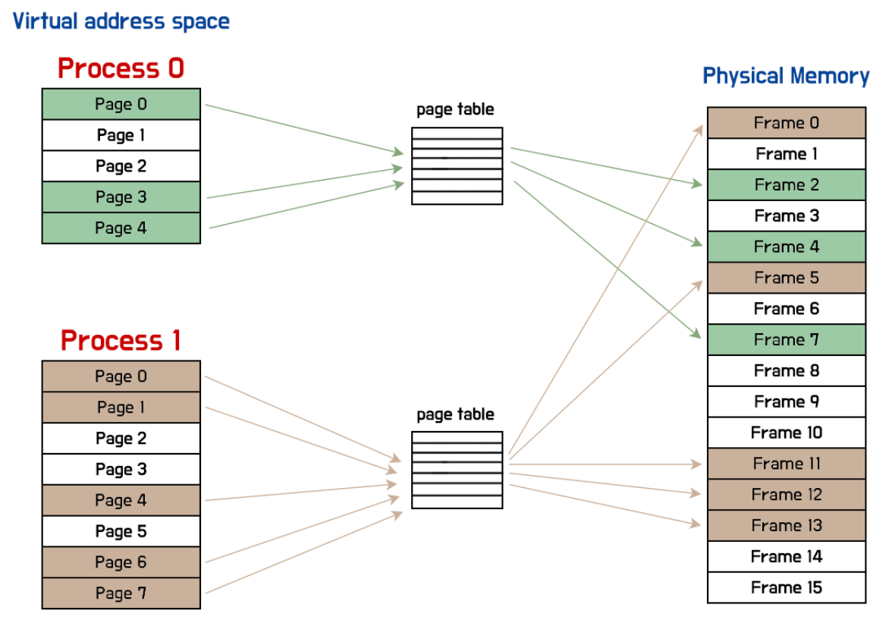
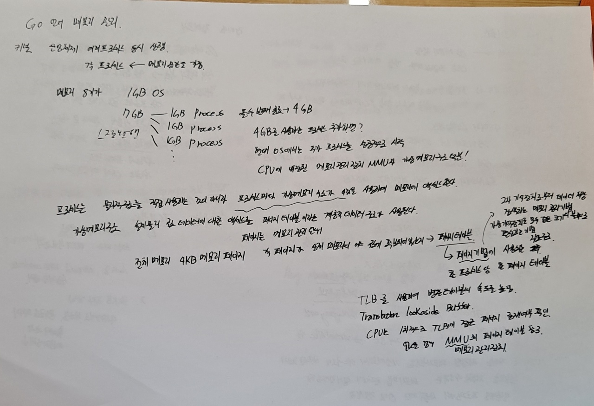
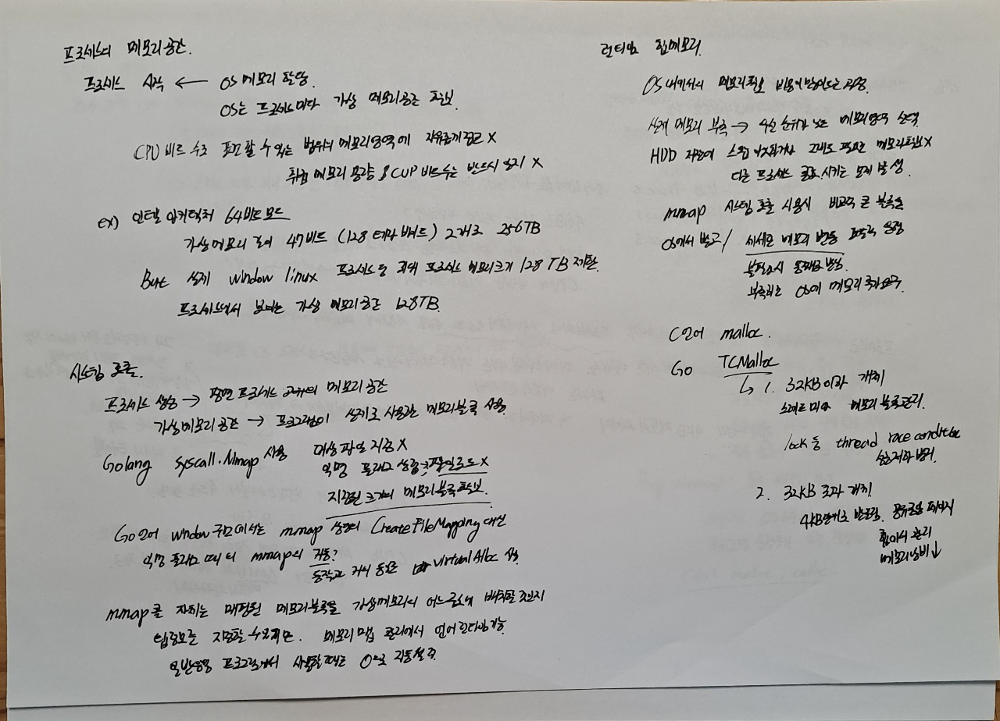
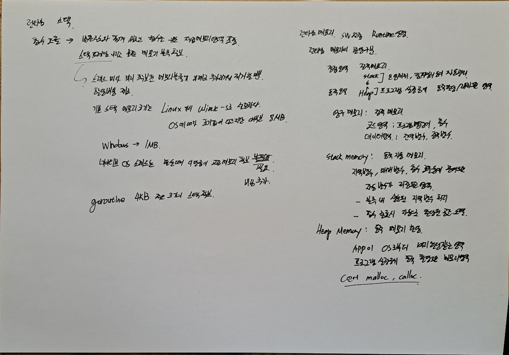

# [번역] Go 언어의 메모리 관리

작성자: 김흥배님

출처: Golang Korea

facebook:

https://www.facebook.com/groups/golangko/permalink/1988811434629659/

위키피디아

페이지 테이블: https://ko.wikipedia.org/wiki/%ED%8E%98%EC%9D%B4%EC%A7%80_%ED%85%8C%EC%9D%B4%EB%B8%94

페이징 : https://ko.wikipedia.org/wiki/%ED%8E%98%EC%9D%B4%EC%A7%95

변환 색인 버퍼 TLB Translation Lookaside Buffer

https://ko.wikipedia.org/wiki/%EB%B3%80%ED%99%98_%EC%83%89%EC%9D%B8_%EB%B2%84%ED%8D%BC

# 런타임 메모리, S/W 메모리

http://www.ktword.co.kr/test/view/view.php?m_temp1=5981

