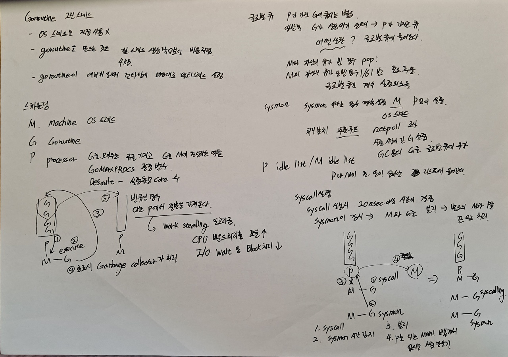

# [번역] Golang 스케쥴러 관련 이야기

작성자: 김흥배님 

출처: Golang Korea

facebook : https://www.facebook.com/groups/golangko/permalink/1990959041081565/

reference 

구현: https://github.com/golang/go/blob/go1.9.3/src/runtime/netpoll.go#L164

참조: https://pkg.go.dev/cmd/compile#hdr-Compiler_Directives

- 구현을 보고 이해가 더 안되는...
- 스케쥴러
  - syscall 실행시 동작
  - 네트워크 처리 netpoller 
  - Goroutine 실행 시간이 긴 경우 
  - channel receive / send 했을 때 

